<div align="center">

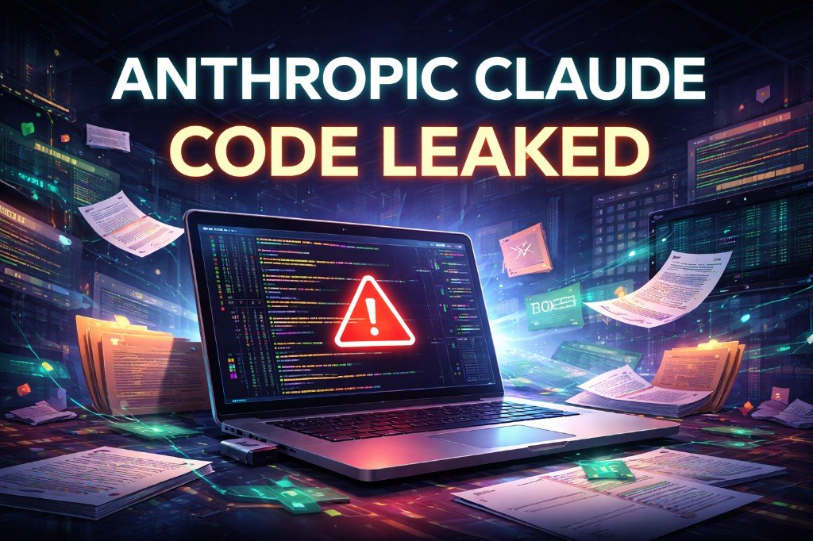

<br>

<h1>
  
  
  
</h1>

</div>

<p align="center">
  <b>🚨 The Complete Decompiled Source of Anthropic's Agentic Coding CLI 🚨</b>
</p>

<p align="center">
  <code>512,000+ lines of TypeScript</code> • <code>1,900+ files</code> • <code>40+ Agent Tools</code> • <code>85+ Commands</code>
</p>

<p align="center">
  
  
  
</p>

<p align="center">
  <a href="#-overview"></a>
  <a href="#-architecture"></a>
  <a href="#-tools"></a>
  <a href="#-commands"></a>
  <a href="#-feature-flags"></a>
</p>

<p align="center">
  
  
  
  
  
</p>

---

<div align="center">

## ⚠️ IMPORTANT DISCLAIMER

</div>

> **📚 EDUCATIONAL & RESEARCH PURPOSES ONLY**
>
> This repository contains source code that was **accidentally leaked** by Anthropic through their npm package (version 2.1.88) on **March 31, 2026**. A source map file (`.map`) was inadvertently bundled into production, allowing complete reconstruction of the original TypeScript source.
>
> - ❌ **DO NOT** use this code for commercial purposes
> - ❌ **DO NOT** create competing products based on this code  
> - ❌ **DO NOT** use this to circumvent Anthropic's security measures
> - ✅ **DO** use for learning, research, and understanding AI coding assistants
>
> **This code is proprietary and owned by Anthropic. All rights reserved by Anthropic.**

---

<div align="center">

## 📊 At a Glance

</div>

<table align="center">
<tr>
<td align="center"><b>📁 Files</b><br><code>1,900+</code></td>
<td align="center"><b>📝 Lines</b><br><code>512,000+</code></td>
<td align="center"><b>🔧 Tools</b><br><code>40+</code></td>
<td align="center"><b>⌨️ Commands</b><br><code>85+</code></td>
<td align="center"><b>🚩 Flags</b><br><code>44+</code></td>
</tr>
</table>

---

## 📖 Table of Contents

<details>
<summary>Click to expand</summary>

- [Overview](#-overview)
- [How It Leaked](#-how-it-leaked)
- [Architecture](#-architecture)
- [Directory Structure](#-directory-structure)
- [Core Engine](#-core-engine)
- [Tools](#-tools)
- [Commands](#-commands)
- [Feature Flags](#-feature-flags)
- [Skills System](#-skills-system)
- [MCP Integration](#-mcp-integration)
- [Security](#-security)
- [Easter Eggs](#-easter-eggs)
- [Model Information](#-model-information)
- [Tech Stack](#-tech-stack)
- [Internal Codenames](#-internal-codenames)
- [References](#-references)

</details>

---

## 🌟 Overview

**Claude Code** is Anthropic's official agentic coding assistant — a powerful AI-powered tool that can:

```
┌────────────────────────────────────────────────────────────────────────┐
│                                                                        │
│   🖥️  Read, write, and edit files in your codebase                    │
│   ⚡  Execute shell commands and scripts                               │
│   🔍  Search code with regex and glob patterns                         │
│   🤖  Spawn sub-agents for parallel work                               │
│   🌐  Fetch web content and search the internet                        │
│   🔌  Connect to external tools via MCP (Model Context Protocol)       │
│   📋  Manage tasks, todos, and session state                           │
│   🎨  Provide beautiful terminal UI with themes                        │
│                                                                        │
└────────────────────────────────────────────────────────────────────────┘
```

### Available Platforms

| Platform | Status | Description |
|----------|--------|-------------|
| 🖥️ **CLI** | ✅ Primary | `claude` command in terminal |
| 💻 **VS Code** | ✅ Available | Extension for VS Code |
| 🔧 **JetBrains** | ✅ Available | Plugin for IntelliJ-based IDEs |
| 🌐 **Web** | ✅ Available | claude.ai/code |
| 🍎 **Desktop** | ✅ Available | Mac & Windows apps |

---

## 🔓 How It Leaked

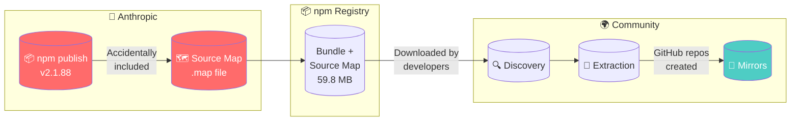

**Timeline:**
- **March 31, 2026** — Source map accidentally bundled in npm package v2.1.88
- **Within hours** — Community discovers and extracts 512K+ lines of TypeScript
- **Same day** — Multiple GitHub mirrors created before DMCA takedowns
- **Ongoing** — Anthropic issues takedown requests; mirrors persist

---

## 🏗 Architecture

### High-Level System Design

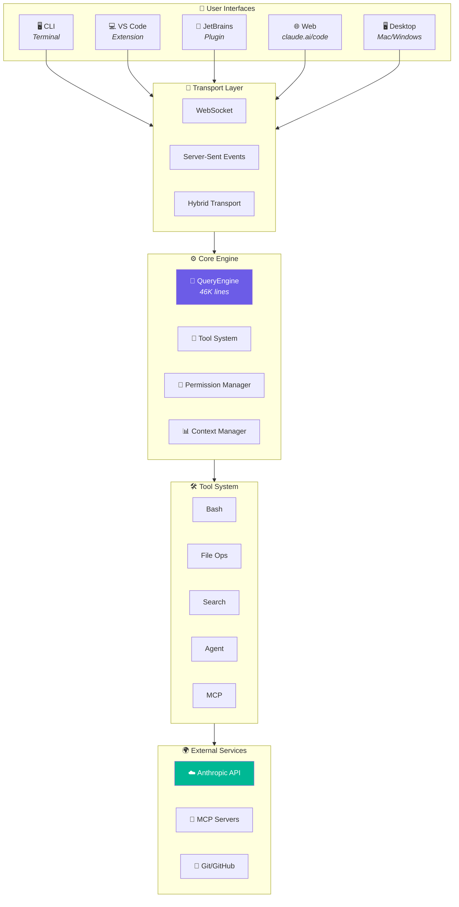

### Request Flow

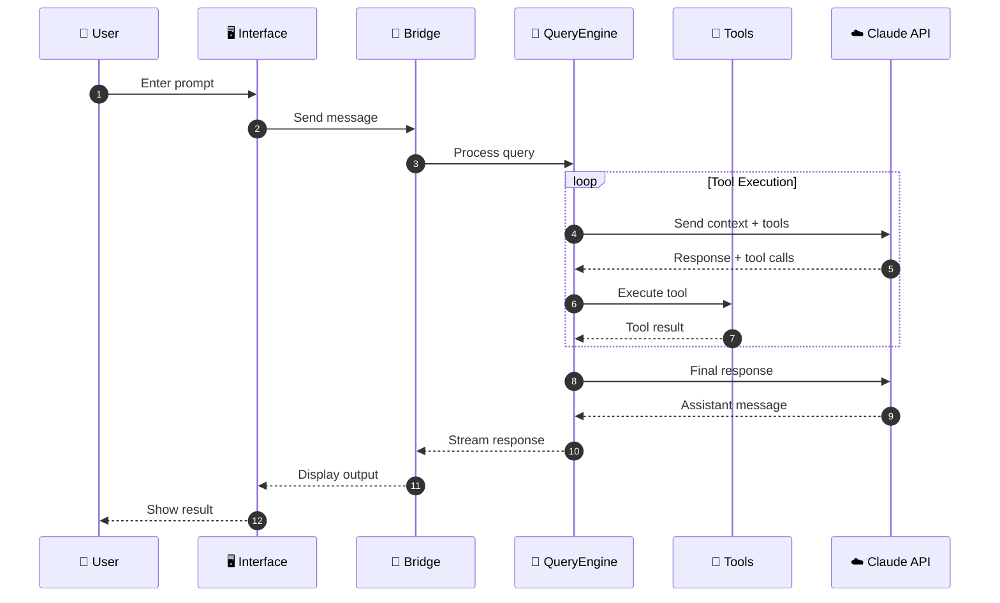

### Tool Execution Pipeline

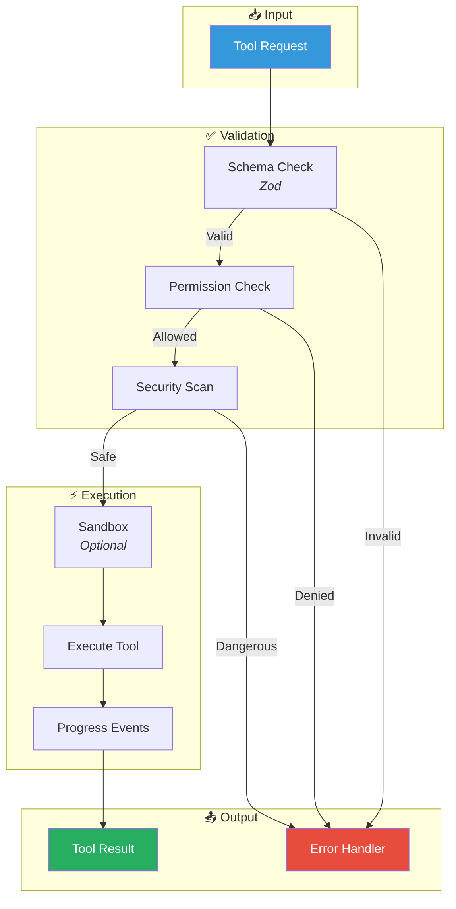

---

## 📂 Directory Structure

```
claude-code/
│
├── 🎯 main.tsx                    # Application entry point
├── 📋 commands.ts                 # Command registry (85+ commands)
├── 🔧 Tool.ts                     # Tool base definitions
├── 🔍 query.ts                    # Query execution
├── 🧠 QueryEngine.ts              # Core LLM engine (46K lines!)
│
├── 🌉 bridge/                     # Remote session management
│   ├── bridgeMain.ts              #   Main orchestration
│   ├── replBridge.ts              #   REPL implementation
│   ├── sessionRunner.ts           #   Session execution
│   └── types.ts                   #   Type definitions
│
├── 💻 cli/                        # Command-line interface
│   ├── handlers/                  #   Command handlers
│   ├── transports/                #   SSE, WebSocket, Hybrid
│   │   ├── SSETransport.ts
│   │   ├── WebSocketTransport.ts
│   │   └── HybridTransport.ts
│   └── print.ts                   #   Output formatting
│
├── ⌨️ commands/                   # Slash commands (~85)
│   ├── commit.ts                  #   /commit
│   ├── compact/                   #   /compact
│   ├── config/                    #   /config
│   ├── doctor/                    #   /doctor
│   ├── mcp/                       #   /mcp
│   ├── plan/                      #   /plan
│   ├── review/                    #   /review
│   ├── buddy/                     #   /buddy (Easter egg!)
│   └── ...                        #   Many more...
│
├── 🎨 components/                 # React/Ink UI components
│   ├── Spinner.js
│   ├── ThemePicker.tsx
│   └── ...
│
├── 📜 constants/                  # Prompts & configuration
│   ├── prompts.ts                 #   System prompts (THE BRAIN!)
│   ├── cyberRiskInstruction.ts    #   Security guardrails
│   └── outputStyles.ts            #   Output formatting
│
├── 🪝 hooks/                      # React hooks
│   ├── useCanUseTool.ts
│   ├── toolPermission/
│   └── ...
│
├── 🧠 memdir/                     # Memory persistence
│   ├── memdir.ts
│   ├── memoryTypes.ts
│   └── findRelevantMemories.ts
│
├── ⚙️ services/                   # Core services
│   ├── analytics/                 #   Telemetry (GrowthBook, DataDog)
│   ├── api/                       #   Claude API client
│   ├── compact/                   #   Context compaction
│   ├── mcp/                       #   Model Context Protocol
│   ├── oauth/                     #   Authentication
│   └── plugins/                   #   Plugin management
│
├── 🎯 skills/                     # Skills system
│   ├── bundled/                   #   Built-in skills
│   │   ├── debug.ts
│   │   ├── verify.ts
│   │   ├── simplify.ts
│   │   └── ...
│   └── loadSkillsDir.ts
│
├── 🛠️ tools/                      # Agent tools (~40)
│   ├── BashTool/                  #   Shell execution
│   ├── FileReadTool/              #   Read files
│   ├── FileEditTool/              #   Edit files
│   ├── FileWriteTool/             #   Create files
│   ├── GrepTool/                  #   Content search
│   ├── GlobTool/                  #   File patterns
│   ├── AgentTool/                 #   Sub-agents
│   ├── WebFetchTool/              #   Fetch URLs
│   ├── WebSearchTool/             #   Web search
│   ├── MCPTool/                   #   MCP integration
│   └── ...
│
├── 🔧 utils/                      # Utilities
│   ├── bash/                      #   Bash parsing
│   ├── permissions/               #   Permission system
│   ├── sandbox/                   #   Sandbox execution
│   └── ...
│
└── ⌨️ vim/                        # Vim keybindings
    ├── motions.ts
    ├── operators.ts
    └── textObjects.ts
```

---

## 🧠 Core Engine

### QueryEngine — The Brain

The `QueryEngine.ts` is the heart of Claude Code with **46,000+ lines** handling:

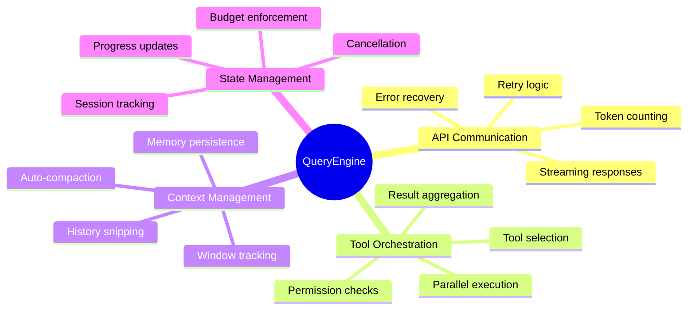

### System Prompts — The Personality

Located in `constants/prompts.ts`, this defines Claude Code's behavior:

```typescript
// Key sections in the system prompt:
├── Identity & Capabilities
├── Tool Usage Guidelines
├── Code Style Preferences
├── Security Constraints
├── Output Formatting Rules
├── Language Preferences
├── MCP Instructions
└── Autonomous Mode Rules
```

---

## 🛠 Tools

Claude Code provides **40+ tools** organized by category:

### Complete Tool Map

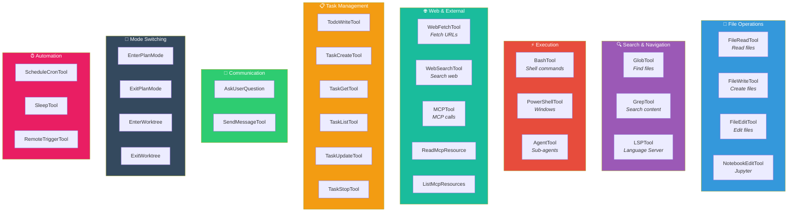

### Tool Details

<details>
<summary><b>📁 File Operations</b></summary>

| Tool | Description | Key Features |
|------|-------------|--------------|
| `FileReadTool` | Read file contents | Line numbers, encoding detection |
| `FileWriteTool` | Create new files | Atomic writes, backup |
| `FileEditTool` | Edit existing files | Search/replace, multi-edit |
| `NotebookEditTool` | Edit Jupyter notebooks | Cell-level editing |

</details>

<details>
<summary><b>🔍 Search & Navigation</b></summary>

| Tool | Description | Key Features |
|------|-------------|--------------|
| `GlobTool` | Find files by pattern | Recursive, exclusions |
| `GrepTool` | Search file contents | Regex, context lines |
| `LSPTool` | Language Server Protocol | Go-to-definition, hover |

</details>

<details>
<summary><b>⚡ Execution</b></summary>

| Tool | Description | Key Features |
|------|-------------|--------------|
| `BashTool` | Execute shell commands | Timeout, sandbox, streaming |
| `PowerShellTool` | Windows PowerShell | Cross-platform |
| `AgentTool` | Spawn sub-agents | Parallel work, fork mode |

</details>

<details>
<summary><b>🌐 Web & External</b></summary>

| Tool | Description | Key Features |
|------|-------------|--------------|
| `WebFetchTool` | Fetch URL contents | Markdown conversion |
| `WebSearchTool` | Search the web | Multiple providers |
| `MCPTool` | Call MCP tools | Dynamic discovery |
| `ReadMcpResourceTool` | Read MCP resources | URI-based |
| `ListMcpResourcesTool` | List MCP resources | Discovery |

</details>

---

## ⌨️ Commands

### Command Distribution

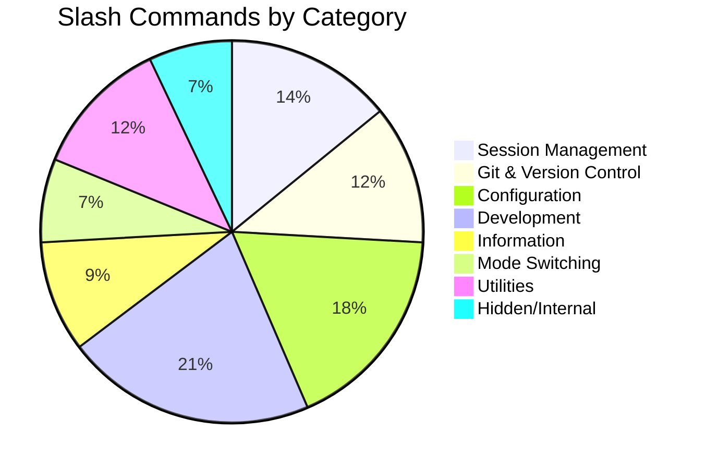

### Complete Command Reference

<details>
<summary><b>📂 Session Management</b></summary>

```bash
/session        # Manage sessions
/resume         # Resume previous session
/clear          # Clear conversation
/compact        # Compact context window
/exit           # Exit Claude Code
/export         # Export session
/share          # Share session link
```

</details>

<details>
<summary><b>🔀 Git & Version Control</b></summary>

```bash
/commit         # Create git commit
/commit-push-pr # Commit, push, and create PR
/branch         # Manage branches
/pr_comments    # View PR comments
/diff           # Show diffs
/review         # Code review
```

</details>

<details>
<summary><b>⚙️ Configuration</b></summary>

```bash
/config         # Edit configuration
/permissions    # Manage permissions
/hooks          # Configure hooks
/theme          # Change theme
/vim            # Toggle vim mode
/keybindings    # Configure keybindings
/model          # Switch models
/output-style   # Change output style
```

</details>

<details>
<summary><b>🛠️ Development</b></summary>

```bash
/doctor         # Run diagnostics
/init           # Initialize project
/mcp            # Manage MCP servers
/plugin         # Manage plugins
/skills         # List available skills
/agents         # List available agents
```

</details>

<details>
<summary><b>📊 Information</b></summary>

```bash
/help           # Show help
/cost           # Show usage costs
/usage          # Show API usage
/stats          # Show statistics
/insights       # Generate session report
/version        # Show version
```

</details>

<details>
<summary><b>🔀 Mode Switching</b></summary>

```bash
/plan           # Enter planning mode
/fast           # Toggle fast mode
/voice          # Toggle voice mode
/assistant      # Assistant mode (hidden)
/proactive      # Autonomous mode (hidden)
```

</details>

<details>
<summary><b>🎁 Hidden Commands</b></summary>

```bash
/buddy          # 🐾 Digital pet system!
/dream          # Dream mode (KAIROS)
/torch          # Unknown feature
/ultraplan      # Advanced planning
/ultrareview    # Advanced review
/stickers       # Sticker system
```

</details>

---

## 🚩 Feature Flags

Claude Code uses **44+ feature flags** for gradual rollouts:

### Flag Categories

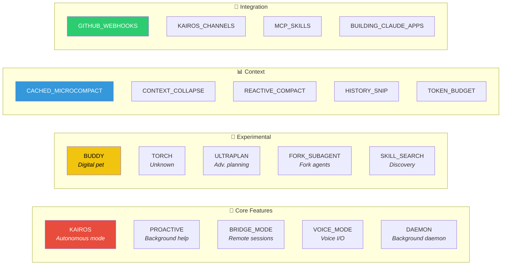

### Complete Flag Reference

| Flag | Category | Description |
|------|----------|-------------|
| `KAIROS` | Core | Autonomous agent mode |
| `PROACTIVE` | Core | Proactive assistance |
| `BRIDGE_MODE` | Core | Remote bridge functionality |
| `VOICE_MODE` | Core | Voice input/output |
| `DAEMON` | Core | Background daemon mode |
| `BUDDY` | Experimental | 🐾 Digital pet system |
| `TORCH` | Experimental | Unknown advanced feature |
| `ULTRAPLAN` | Experimental | Advanced planning mode |
| `FORK_SUBAGENT` | Experimental | Fork-based subagents |
| `EXPERIMENTAL_SKILL_SEARCH` | Experimental | Skill discovery |
| `CACHED_MICROCOMPACT` | Context | Cached context compaction |
| `CONTEXT_COLLAPSE` | Context | Context collapsing |
| `REACTIVE_COMPACT` | Context | Reactive compaction |
| `HISTORY_SNIP` | Context | History trimming |
| `TOKEN_BUDGET` | Context | Token budget tracking |
| `KAIROS_GITHUB_WEBHOOKS` | Integration | GitHub webhooks |
| `KAIROS_CHANNELS` | Integration | Channel communication |
| `MCP_SKILLS` | Integration | MCP-based skills |
| `BUILDING_CLAUDE_APPS` | Integration | Claude API assistance |
| `BASH_CLASSIFIER` | Internal | Command classification |
| `TRANSCRIPT_CLASSIFIER` | Internal | Transcript analysis |
| `VERIFICATION_AGENT` | Internal | Verification subagent |
| `REVIEW_ARTIFACT` | Internal | Review artifacts |

---

## 🎯 Skills System

### How Skills Work

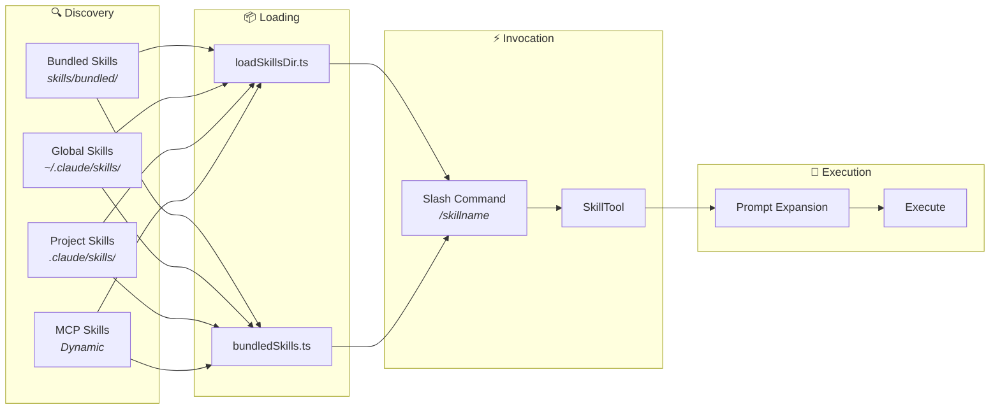

### Bundled Skills

```typescript
skills/bundled/
├── 🐛 debug.ts           // /debug - Debugging assistance
├── ✅ verify.ts          // /verify - Verification
├── 🎯 simplify.ts        // /simplify - Code simplification
├── 💾 remember.ts        // /remember - Memory management
├── ⌨️ keybindings.ts     // /keybindings - Keybinding help
├── 🆘 stuck.ts           // /stuck - Help when stuck
├── 📦 batch.ts           // /batch - Batch operations
├── ✨ skillify.ts        // /skillify - Create new skills
├── 📝 loremIpsum.ts      // /loremIpsum - Placeholder text
├── ⚙️ updateConfig.ts    // /updateConfig - Config updates
├── 🔌 claudeApi.ts       // Claude API help (gated)
├── 🌐 claudeInChrome.ts  // Chrome integration
├── 🔄 loop.ts            // /loop - Looping (gated)
├── 💭 dream.ts           // /dream - Dream mode (gated)
└── 🔍 hunter.ts          // /hunter - Bug hunting (gated)
```

### Custom Skill Format

```markdown
---
name: my-custom-skill
description: What this skill does
---

# My Custom Skill

Instructions for Claude when this skill is invoked...

## Steps
1. First, do this
2. Then, do that
3. Finally, complete the task
```

---

## 🔌 MCP Integration

### Model Context Protocol Architecture

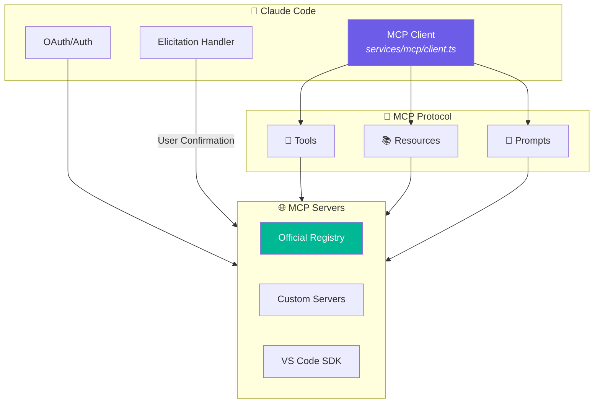

### MCP Services

```
services/mcp/
├── 🔌 client.ts              # MCP client implementation
├── ⚙️ config.ts              # Configuration
├── 📦 types.ts               # Type definitions
├── 🔐 auth.ts                # OAuth for MCP servers
├── ☁️ claudeai.ts            # Claude.ai integration
├── 💻 vscodeSdkMcp.ts        # VS Code SDK
├── 🔒 channelAllowlist.ts    # Channel permissions
├── ❓ elicitationHandler.ts  # User prompting
├── 📋 officialRegistry.ts    # Official servers
└── 🛠️ utils.ts               # Utilities
```

---

## 🔐 Security

### Security Architecture

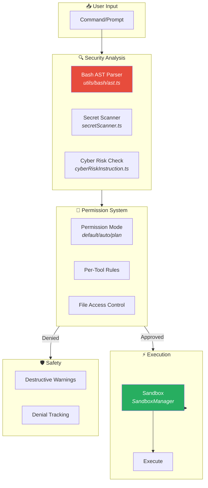

### Cyber Risk Instruction

The security guardrail in `constants/cyberRiskInstruction.ts`:

```typescript
export const CYBER_RISK_INSTRUCTION = `
IMPORTANT: Assist with authorized security testing, 
defensive security, CTF challenges, and educational 
contexts. 

REFUSE requests for:
❌ Destructive techniques
❌ DoS attacks  
❌ Mass targeting
❌ Supply chain compromise
❌ Detection evasion for malicious purposes
`
```

### Permission Modes

| Mode | Description | Risk Level |
|------|-------------|------------|
| `default` | Ask for each action | 🟢 Low |
| `plan-mode` | Read-only operations | 🟢 Low |
| `auto-approve` | Auto-approve safe actions | 🟡 Medium |

---

## 🎁 Easter Eggs

### 🐾 BUDDY — Digital Pet System

A hidden feature gated behind `feature('BUDDY')`:

```typescript
const buddy = feature('BUDDY')
  ? require('./commands/buddy/index.js').default
  : null
```

The BUDDY system appears to be a **digital pet/companion** feature — your coding buddy that lives inside Claude Code!

### 🎨 Stickers

```bash
/stickers  # Sticker-related functionality
```

### 💭 Dream Mode

```bash
/dream  # Available when KAIROS or KAIROS_DREAM flags are enabled
```

---

## 🤖 Model Information

### Supported Models

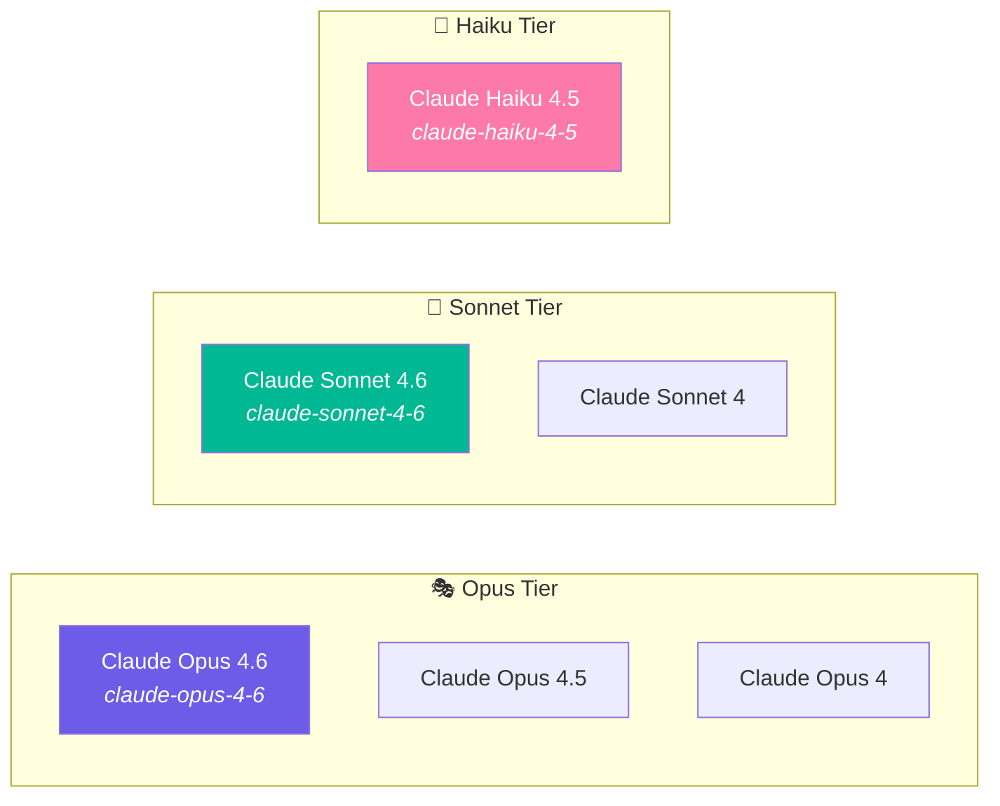

### Knowledge Cutoffs

| Model | Cutoff Date |
|-------|-------------|
| Claude Opus 4.6 | **May 2025** |
| Claude Sonnet 4.6 | **August 2025** |
| Claude Opus 4.5 | May 2025 |
| Claude Haiku 4.x | February 2025 |
| Claude Opus 4 / Sonnet 4 | January 2025 |

### Fast Mode

> **Note:** Fast mode uses the **same frontier model** (Opus 4.6) with optimized output generation — it does NOT switch to a different model!

---

## 🛠️ Tech Stack

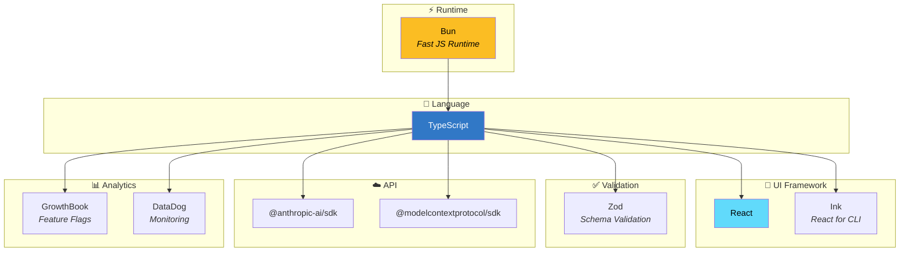

### Key Dependencies

| Package | Purpose |
|---------|---------|
| `bun` | JavaScript runtime & bundler |
| `@anthropic-ai/sdk` | Anthropic API client |
| `@modelcontextprotocol/sdk` | MCP implementation |
| `zod` | Schema validation |
| `ink` | React for terminals |
| `lodash-es` | Utility functions |

---

## 🔤 Internal Codenames

| Codename | Meaning |
|----------|---------|
| `ant` | Anthropic internal user type |
| `Kairos` | Autonomous agent mode |
| `Proactive` | Background agent assistance |
| `Bridge` | Remote session management |
| `CCR` | Claude Code Remote |
| `FRC` | Function Result Clearing |
| `Undercover` | Mode that hides model names (for unannounced models) |
| `Tengu` | Verification agent codename |
| `Chicago MCP` | Unknown MCP integration |
| `Grove` | Unknown service integration |
| `Buddy` | Digital pet feature |
| `Torch` | Unknown experimental feature |

---

## 📚 References

| Resource | Link |
|----------|------|
| 📰 Original Leak Report | [dev.to Article](https://dev.to/evan-dong/claude-codes-entire-source-code-just-leaked-512000-lines-exposed-3139) |
| 📰 Decrypt Coverage | [Decrypt Article](https://decrypt.co/362917/anthropic-accidentally-leaked-claude-code-source-internet-keeping-forever) |
| 🏢 Official Repository | [anthropics/claude-code](https://github.com/anthropics/claude-code) |
| 🔍 Deobfuscation Project | [ghuntley/claude-code-source-code-deobfuscation](https://github.com/ghuntley/claude-code-source-code-deobfuscation) |

---

<div align="center">

## 📜 License & Legal

This source code is **proprietary** and owned by **Anthropic**.

This repository is maintained **strictly for educational and research purposes**.

All rights reserved by Anthropic.

---

<sub>Last updated: March 2026 • This is an archival repository</sub>

</div>
